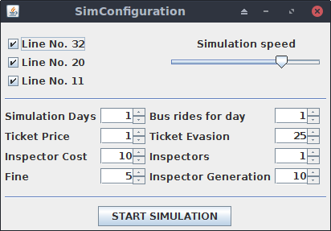
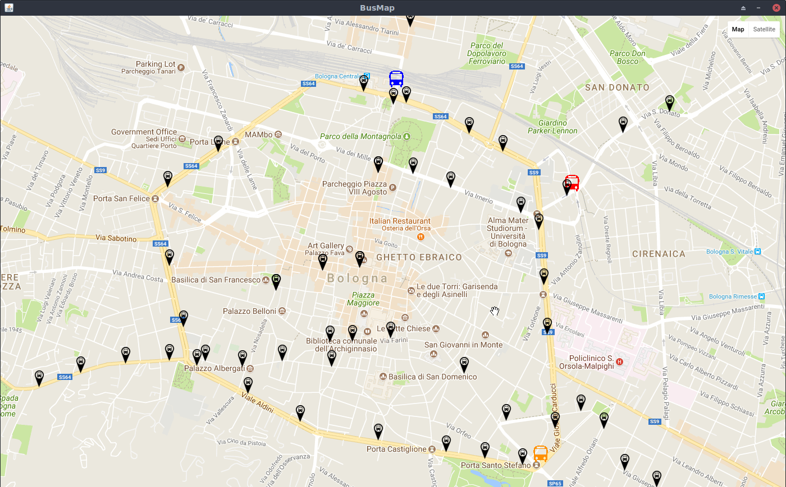

# SMART-M3Project
This is a project for the Interoperability of Embedded System lab at the university of Bologna.
In this project we used a Semantic Information Broker called OSGi_SIB v3.2, developed by ARCES.
The SIB is a SPARQL endpoint built on top of an RDF triple-store.  This publish-subscribe broker allows to:
• update the knowledge base (using SPARQL, RDF/XML or a triple-pattern based formalism, i.e.  RDF-M3)
• query the knowledge base (through SPARQL or RDF-M3)
• subscribe to user-defined subgraphs (through SPARQL or RDF-M3)

In oder to execute this application you should have OSGi_SIB and run the SIB:

    1) run the SIB:
    
          java -jar org.eclipse.osgi*.jar
     
    2) Move into the jar directory:
        cd ./jar 
    
    3) execute the main program:
            java -jar Bologna-BusSimulator.jar (note that in the same directory you should have all the required resources (res and gpx directories) )
    

The main idea of this project is to simulate several bus rides in the city of Bologna and to provide statistics at the end of the simulation. When the application starts, you can set some parameters, like which bus simulate (actually there are three option), number of days to simulate, number of rides for each bus, ticket price for a single ride etc..

Once the application is started, you should see a map with the selected bus. Each bus is represented by a particular marker; also each bus stop is marked.

At the end of the simulation some statistics are provided, for example:

• Segment (path between two consecutive bus stops) with more people

• Line with the maximum number of fines

• Balance for each bus line (could be positive or negative, it depends on the number of ticket sold, the number of ticket inspector, and the number of fines).

[Here](videoExample.mkv) you can find a video with a little demonstration.

[Here](interoperability-embedded-systems.pdf) the Italian presentation used for the project.

SMART-M3Project uses JxMaps https://www.teamdev.com/jxmaps, which is a proprietary software. The use of JxMaps is governed by JxMaps Product Licence Agreement https://www.teamdev.com/jxmaps/licence-agreement. If you would like to use JxMaps in your development, please contact TeamDev.

